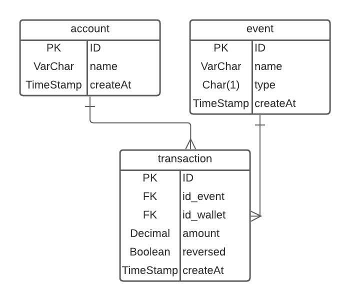

 
  
Api Wallet Digital com **NestJs**.

   
  <!--
  -->

## Description

[Nest](https://github.com/nestjs/nest) framework.

## Arquitetura

A API foi construída usando as sugestões da documentação do [NestJS](https://docs.nestjs.com/first-steps) e arquitetura de <b>Repository Pattern</b>.

### Repository/Services
Foi escolhido o TypeORM para gerenciamento dos repositories e banco de dados, ao invés de construir os respository manualmente, foi utilizado os repository fornecidos pelo TypeORM.

Em src/services encontra toda regra da aplicação e as conexões com os repositories.

### Testes
Os testes de services está em src/services/services.spec.ts 

Para os testes foi criado um DataSource especifico para teste, validando os dados comunicando com o banco.

### Validações
Para facilitar o desenvolvimento e manutenção para validação dos dados trafegados foi utilizados DTO em src/dto

## Banco
O banco SQL escolhido foi o Postgres, com a utilização do TypeORM é possível trocar a tecnologia do banco sem mexer na regra da aplicação.

### DER

Para o Banco imaginei a seguinte estrutura:

**Account** onde armazena os dados do cliente, aqui ficaria outras informações como agencia e conta.  
**Events** tabela de eventos fica armazenado os tipos de eventos como Crédito, Débito, Compra, Pix, TED... qualquer evento que seja preciso adicionar no sistema basta inserir na tabela.   
Em **Type** fica salvo o tipo de evento se é Crédito ou Débito, neste caso usei apenas os dois simbolizando crédito em conta ou débito em conta.
  Ex: 
- Compras é um débito em conta Type = D
- Receber pix é um crédito em conta Type = C

Assim eu consigo saber se aquele evento vai retirar ou debitar dinheiro da conta

**Transaction** é a tabela de transações onde consta o valor da transação, evento e o conta

## Stay in touch

- Author - [Kamil Myśliwiec](https://kamilmysliwiec.com)
- Website - [https://nestjs.com](https://nestjs.com/)
- Twitter - [@nestframework](https://twitter.com/nestframework)

## License

Nest is [MIT licensed](LICENSE).
